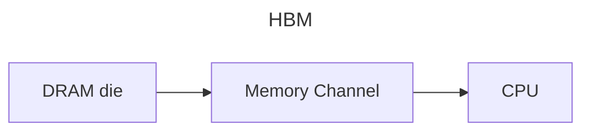
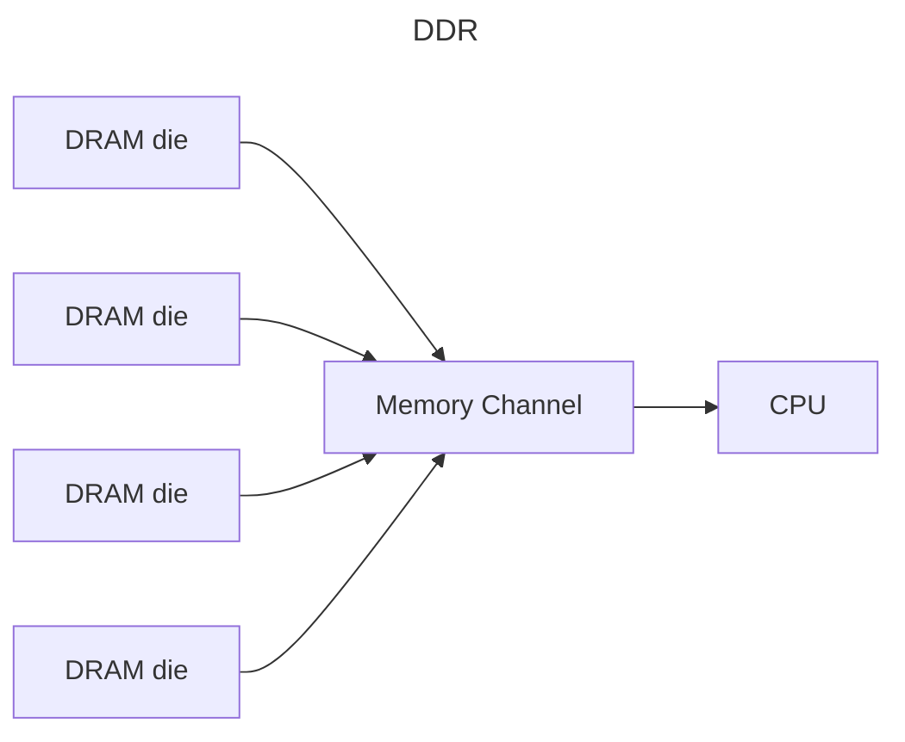

---
aliases:
  - memory channel
  - memory channels
  - BLSA
  - SWD
  - DQ
  - DQs
  - memory bank
  - memory banks
  - memory cell
  - memory cells
---

A single server has memory which is composed of multiple *DRAM dies*.

## Connecting DRAM to CPUs

Memory is connected to the host CPU through _memory channels_.

In HBM, each DRAM die has its own memory channel:

In standard DDR DIMMs, multiple dies share a single memory channel.

## Inside a DRAM die

_Cells_ are the lowest-level containers of information in DRAM.

Cells are grouped into _mats_.

Mats have columns and rows.

- Cells in a column are connected to a single bitline sense amplifier (BLSA).
- Rows are selected using a sub-wordline driver (SWD)

Mats are grouped into _subarrays_, and subarrays are grouped into _subbanks_.  A collection of subbanks forms a _bank_.

Banks are independently controllable even though they all share a single memory channel.

_DQ_ pins (DQs) are the data pins from which DRAM data is sent out.

Between the DQs and the BLSAs is a _column decoder_ which routes BLSAs to DQs. Column remaps are implemented here during manufacturing to improve yield.[^1]

[^1]: [Predicting Future-System Reliability with a Component-Level DRAM Fault Model | Proceedings of the 56th Annual IEEE/ACM International Symposium on Microarchitecture](https://dl.acm.org/doi/10.1145/3613424.3614294)