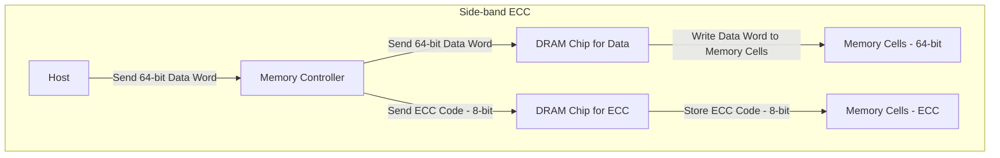
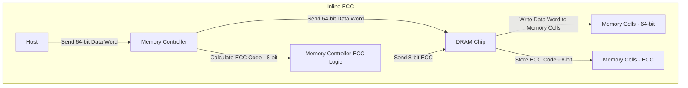
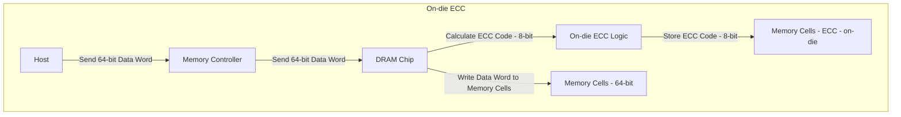

## Types of DRAM faults

- **Single-bit error correction (SEC)** correct single bit flips.
- **Single-symbol correction (SSC)** can correct multiple bit flips within a single symbol.
- **Single-device data correction (SDDC)** is a subset of SSC where a symbol is striped across an entire DRAM die.[^2] ChipKill is an example of SDDC.

BCH codes are used to protect against single-bit errors, and Reed-Solomon codes are used to protect against symbol errors.

## Types of ECC

> [!warning]
> I _think_ the following is correct based on[^1] and ChatGPT, but it may not be quite right. The nomenclature is also inconsistent in the diagrams; someday I'll fix it.

### Side-band ECC

Side-band ECC is when you have additional bandwidth to transmit ECC. DDR4 has a 64-bit data width and 8 additional bits for ECC, making the total width (code word) 72 bits. These are additional DRAM dies (two x4 or one x8) to store those additional ECC bits as well.

Because ECC bits have their own dedicated resources, there is no performance or capacity penalty for using side-band ECC over non-ECC. There is a cost penalty, however, as ECC memory requires more DRAM dies and is therefore more expensive than non-ECC memory.

### Inline ECC

Inline ECC sends the data and ECC along the same fixed-width data bus, impacting bandwidth and usable capacity.

Inline ECC is used in LPDDR5.

### On-die ECC

On-die ECC is a feature of the DRAM itself where the host transmits data (without ECC) to DRAM, and the DRAM is responsible for computing ECC and storing it. There is no bandwidth penalty since the host does not transmit any ECC bits, but this also means that any corruption that occurs between the host and the DRAM cannot be detected

LPDDR4, LPDDR5, DDR5, HBM, and GDDR6 support this.

[^1]: [What Designers Need to Know About Error Correction Code (ECC) In DDR Memories (semiengineering.com)](https://semiengineering.com/what-designers-need-to-know-about-error-correction-code-ecc-in-ddr-memories/)
[^2]: [Predicting Future-System Reliability with a Component-Level DRAM Fault Model | Proceedings of the 56th Annual IEEE/ACM International Symposium on Microarchitecture](https://dl.acm.org/doi/10.1145/3613424.3614294)