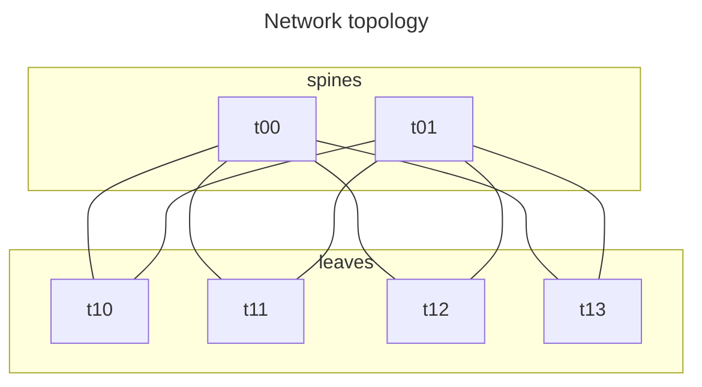
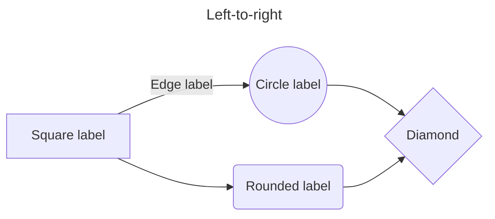

[Obsidian](https://obsidian.md/) is the tool I use to maintain [[index|this knowledge base]]. I also use it extensively for my notes at work since joining Microsoft since:

1. It does not try to upload all my notes (and the secrets therein) to some third-party cloud service. I keep my Obsidian vaults in my corporate OneDrive or Sharepoints, allowing me to comply with corporate data management policy.
2. It supports linking between documents and finding information that I've forgotten very easy. This seems to work best for the way I take and re-read notes.

I've left Obsidian a few times, but I keep coming back. I now pay for a commercial license since I use it primarily for work. Obsidian keeps getting better too, and its direction of development lines up with what I need out of it.

## Organization

I periodically try new ways of organizing, but I've found that just throwing everything into one unorganized pile (as is on display with this site) seems to work best. It lets me focus on just capturing details without the cognitive burden of fitting those details into some rigid folder structure at the same time.

## Reference

I never remember how some of the markdown extensions in Obsidian work.

### Callouts

See [Callouts - Obsidian Help](https://help.obsidian.md/Editing+and+formatting/Callouts) for the full assortment of callouts supported. Quartz supports these too.

> [!note]
> This is a note.

> [!abstract]
> This is an abstract. Aliases are `summary` and `tldr`.

> [!info]
> This is an infobox.

> [!warning]
> Stuff for which the reader should be mindful, like gotchas.

> [!danger]
> Worse than a warning I guess.

> [!question]
> Maybe for internal monologue?

> [!tip]
> This is a tip. Possibly a protip.

> [!example]
> Good for tutorials?

> [!success]
> Not sure how this is meant to be used.

> [!failure]
> Also not sure how this is meant to be used.

> [!todo]
> This is a todo.

> [!bug]
> Lorem ipsum dolor sit amet

> [!quote]
> This is neat. Better than the standard markdown `>`?

## Mermaid graphs

See [Examples | Mermaid](https://mermaid.js.org/syntax/examples.html).

Mermaid seems to be OK at making basic network diagrams, but they get messy fast. I don't know if it is as expressive as graphviz.

